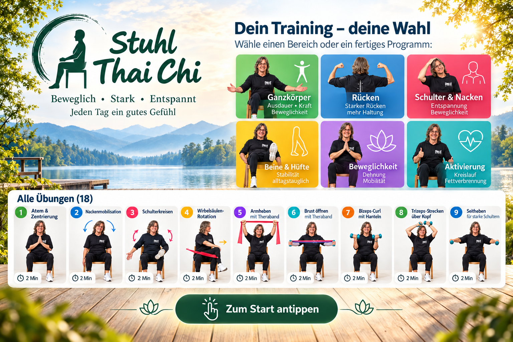

# 🪑 Stuhl Thai Chi

> **Beweglich · Stark · Entspannt**  
> Ein kurzes, alltagstaugliches Stuhl-Training für Mobilität, Kraft, Haltung und sanfte Aktivierung.



---

## ✨ Was die App kann

Die App kombiniert klassische Stuhl-Tai-Chi-Bewegungen mit einfachen Kräftigungsübungen. Du kannst entweder das komplette Morgenprogramm starten oder dir aus deinen gewünschten Körperbereichen automatisch ein 5-, 10- oder 15-Minuten-Programm zusammenstellen lassen.

**Enthalten sind:**

- 18 Übungen für den ganzen Körper
- klassische Stuhl-Tai-Chi-Bewegungen
- Übungen für Rücken, Schulter & Nacken, Beine & Hüfte
- Beweglichkeits- und Aktivierungsübungen
- Übungen mit Theraband und leichten Hanteln
- automatischer Wechsel zur nächsten Übung
- Pausen-, Zurück- und Weiter-Funktion
- Signalton beim Übungswechsel
- Vollbildmodus
- GitHub-Pages- und iPad-taugliche PWA-Struktur

---

## 🚀 Schnellstart

1. App öffnen.
2. Auf dem Startbild **„Zum Start antippen“**.
3. Einen Trainingsbereich wählen oder **Ganzkörper** aktiviert lassen.
4. **5, 10 oder 15 Minuten** auswählen.
5. Gewünschte Hilfsmittel aktivieren.
6. **„Mein Programm starten“** antippen.
7. Die Übung ruhig und kontrolliert ausführen – die App wechselt automatisch weiter.

> Tipp: Für den Morgen ist **10 Minuten · Ganzkörper · ohne oder mit Theraband** ein guter Standard.

---

## 🧭 Die wichtigsten Bereiche

### 🟢 Ganzkörper
Ausgewogene Mischung aus Mobilität, Haltung, Beinen, Rumpf und leichter Aktivierung.

### 🔵 Rücken
Für Wirbelsäule, Rumpfstabilität, aufrechte Haltung und Schulterblattmuskulatur.

### 🔴 Schulter & Nacken
Für Beweglichkeit, Entspannung und sanfte Kräftigung im Schultergürtel.

### 🟡 Beine & Hüfte
Für Knie, Hüfte, Waden, Alltagsstabilität und Beinmuskulatur.

### 🟣 Beweglichkeit
Für Rotation, Seitneigung, Hüftöffnung und lockere Gelenkbewegung.

### 🟦 Aktivierung
Für Kreislauf, Koordination, Rumpfspannung und einen aktiveren Start in den Tag.

---

## ⏱️ Programmdauer und Automatik

Du kannst zwischen **5, 10 und 15 Minuten** wählen. Die App kombiniert dazu passende Übungen automatisch.

Im Standardmodus läuft jede Übung **2 Minuten**. Wenn die gewählte Gesamtdauer sonst überschritten würde, wird die letzte Übung automatisch verkürzt.

Über **⚙︎ Einstellungen** kannst du beim klassischen 8er-Programm alternativ die ursprünglichen Planzeiten verwenden.

---

## 🧰 Hilfsmittel

Du kannst festlegen, welche Hilfsmittel in deinem Programm vorkommen dürfen:

| Auswahl | Verwendung |
|---|---|
| Ohne | reine Stuhl- und Mobilitätsübungen |
| Theraband | Schulter, Rücken, Brust, Beine |
| Hanteln | Arme und Schultern |
| Sonstiges | Stuhl, Halteübungen oder Zusatzvarianten |

**Empfehlung:** lieber mit leichtem Widerstand beginnen. Saubere Bewegung ist wichtiger als Kraft.

---

## ▶️ Während des Trainings

In der Übungsansicht findest du:

- **Countdown** bis zum automatischen Wechsel
- **Fortschrittsbalken**
- **Zurück** zur vorherigen Übung
- **Pause / Weiter**
- **Weiter** zur nächsten Übung
- **⛶ Vollbild** für iPad oder größere Darstellung

Bei den zusätzlichen Übungen siehst du außerdem:

- **So geht’s**
- **Worauf achten**
- **Stärkt**
- **Mobilisiert / dehnt**

---

## 🪑 Das klassische Morgenprogramm

Unterhalb des Programmgenerators findest du weiterhin das ursprüngliche 8er-Programm. Die Übungsfelder im Übersichtsbild sind direkt anklickbar.

Du kannst daher entweder:

- eine einzelne Übung auswählen,
- ab einer bestimmten Übung weitertrainieren,
- oder das komplette klassische Programm starten.

---

## ✅ Trainingshinweise

- Einen **stabilen Stuhl ohne Rollen** verwenden.
- Füße möglichst sicher auf dem Boden platzieren.
- Bewegungen **langsam, kontrolliert und schmerzfrei** ausführen.
- Schultern locker lassen und ruhig weiteratmen.
- Bei Theraband und Hanteln mit **leichtem Widerstand** beginnen.
- Bei Schwindel, ungewöhnlicher Atemnot oder Schmerzen abbrechen.

Die App ersetzt keine medizinische oder physiotherapeutische Beratung.

---

## 📱 Auf dem iPad als App nutzen

1. GitHub-Pages-Adresse in **Safari** öffnen.
2. **Teilen** antippen.
3. **„Zum Home-Bildschirm“** auswählen.
4. Danach startet Stuhl Thai Chi wie eine eigene App.

Die App ist als PWA vorbereitet und speichert wichtige Dateien im Browser-Cache.

---

## 🌐 GitHub Pages

Die Dateien müssen direkt im Repository liegen:

```text
index.html
app.js
style.css
service-worker.js
manifest.webmanifest
README.md
assets/
```

Unter GitHub:

**Settings → Pages → Deploy from a branch → main → /(root)**

Danach stellt GitHub die App über deine Pages-Adresse bereit.

---

## 🆘 Bedienungsanleitung direkt in der App

Oben rechts findest du neben **⚙︎ Einstellungen** jetzt den Button **?**. Dort ist diese Anleitung in kompakter Form direkt innerhalb der App abrufbar.

---

## 🧩 Version

**Stuhl Thai Chi V1.1.2 · Everlast Edition**

Neu in dieser Version:

- Bedienungsanleitung als `README.md`
- integrierte Hilfe direkt in der App
- bestehende Trainingslogik unverändert
- bestehende 18 Übungen unverändert
- bestehender Startbildschirm unverändert

---

### 🌿 Kleine Schritte – große Wirkung für mehr Lebensqualität.
